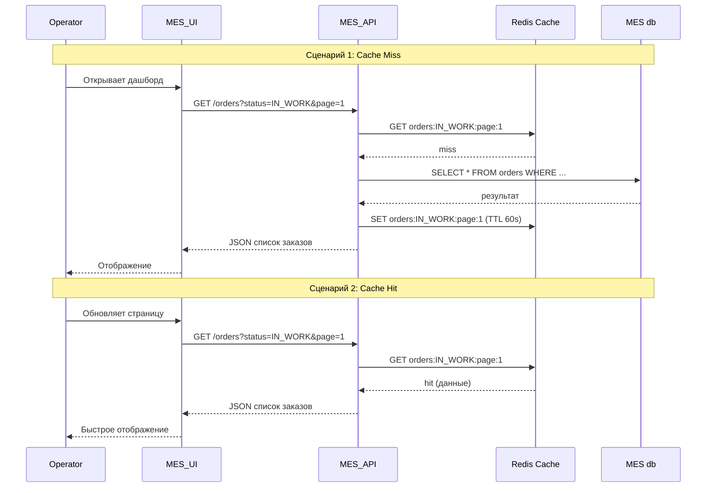
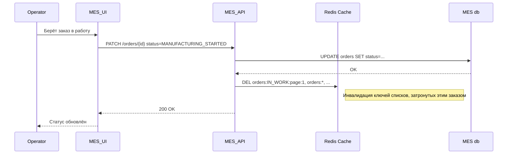

# Архитектурное решение по кешированию

Технический документ: внедрение кеширования для решения проблем производительности MES и ускорения работы операторов.

---

## 1. Анализ системы и C4-диаграммы

### 1.1. Текущая архитектура (по C4)

- **MES** (React) → **MES API** (C#) → **MES db** (PostgreSQL)
- Первая страница MES — дашборд со списком заказов в работе по статусам (фильтр, пагинация).
- Операторы часто обращаются к этой странице: от скорости загрузки зависит возможность «взять» новый заказ и, следовательно, вознаграждение.

### 1.2. Узкие места

| Место | Проблема | Источник |
|-------|----------|----------|
| **Запрос списка заказов** | Медленная загрузка первой страницы MES; фильтр и пагинация не помогли | task.md |
| **MES db** | Один инстанс на запись и чтение; тяжёлые запросы со JOIN, сортировкой и фильтрацией по статусам | C4, описание |
| **Расчёт стоимости** | 2–30 минут — не решается кешированием, требуется асинхронная обработка (отдельная инициатива) | task.md |

### 1.3. Что имеет смысл кешировать

| Данные | Система | Обоснование |
|--------|---------|-------------|
| **Список заказов для дашборда MES** | MES API | Самый «горячий» запрос; read-heavy; при росте числа заказов нагрузка на БД растёт. |
| **Списки по статусам/фильтрам** | MES API | Варианты одного и того же набора данных; можно кешировать по ключу (статус, страница, сортировка). |
| **Отдельный заказ по ID** (при необходимости) | MES API | Меньший приоритет; запрос по одному заказу обычно быстрый. |

Не кешируем: операции записи (изменение статуса), расчёт стоимости (долгий процесс, не снимается кешем).

---

## 2. Мотивация

### 2.1. Зачем вводить кеширование

- **Быстрая загрузка дашборда MES** — операторы сразу видят список заказов, могут брать новые заказы без ожидания. Это напрямую влияет на вознаграждение и скорость обработки.
- **Снижение нагрузки на MES db** — запрос списка заказов тяжёлый; кеш уменьшает число обращений к БД и риск деградации при росте объёма данных.
- **Улучшение восприятия скорости** — для клиентов важно общее время выполнения заказа; оптимизация работы операторов косвенно ускоряет прохождение заказа по производству.

### 2.2. Какие проблемы решаем

| Проблема | Как кеширование помогает |
|----------|--------------------------|
| Медленная первая страница MES | Ответ из кеша за миллисекунды вместо секунд запроса к БД. |
| Жалобы операторов на «тормоза» | Снижение времени загрузки дашборда. |
| Рост нагрузки на БД при увеличении числа заказов | Часть запросов обслуживается из кеша, нагрузка на БД уменьшается. |

### 2.3. Элементы системы, включаемые в кеширование

- **MES API** — серверный кеш (Redis) для ответов «список заказов» с учётом фильтров (статус, страница, сортировка).
- **MES db** — остаётся источником правды; кеш — слой перед БД для чтения.

---

## 3. Предлагаемое решение

### 3.1. Клиентское или серверное кеширование

**Выбор: серверное кеширование.**

| Критерий | Клиентское (браузер) | Серверное (Redis) |
|----------|----------------------|-------------------|
| Список заказов | Данные быстро устаревают; операторам нужны актуальные заказы | Можно задать TTL и инвалидацию при изменении статусов |
| Нагрузка на БД | Каждый оператор всё равно ходит в API → БД | Один ответ из кеша обслуживает многих операторов |
| Сложность | Проще, но мало пользы для «горячих» списков | Сложнее, зато снимает нагрузку с БД |

Клиентский кеш (HTTP Cache-Control) можно добавить для статики и редко меняющихся данных, но основную проблему — тяжёлый запрос списка заказов к БД — решает серверный кеш.

### 3.2. Паттерн кеширования: Cache-Aside

**Выбор: Cache-Aside (Lazy Loading).**

| Паттерн | Суть | Плюсы | Минусы |
|---------|-----|-------|--------|
| **Cache-Aside** | При чтении: проверка кеша → при промахе чтение из БД и запись в кеш. При записи: обновление БД и инвалидация кеша. | Простота; кеш заполняется только для реально запрашиваемых данных; нет лишних записей | Возможен cache stampede при первом запросе после инвалидации |
| **Write-Through** | При записи: обновление БД и синхронное обновление кеша. | Кеш всегда актуален для записанных данных | Сложнее; каждое изменение статуса требует записи в кеш; для списков заказов кешируются агрегации, а не один заказ — при любом изменении нужно обновлять множество ключей |
| **Refresh-Ahead** | Проактивное обновление кеша до истечения TTL. | Меньше промахов | Сложнее; нужны фоновые задачи; избыточно для списка заказов с частыми изменениями |

**Почему Cache-Aside подходит:**

1. Список заказов — это агрегация (не один объект). При Write-Through при каждом изменении статуса пришлось бы пересчитывать и записывать все затронутые списки (по статусам, страницам и т.д.) — сложно и легко ошибиться.
2. Refresh-Ahead увеличивает нагрузку на БД и усложняет логику; выигрыш для списков с частыми изменениями неочевиден.
3. Cache-Aside даёт простую модель: «прочитал из кеша или из БД и положил в кеш»; инвалидация при записи — явная и управляемая.

### 3.3. Диаграмма последовательности

#### Чтение списка заказов (Cache-Aside, промах и попадание)

#### Запись об изменении статуса заказа и инвалидация кеша

#### Участники процесса кеширования

| Участник | Роль |
|----------|------|
| **Operator** | Пользователь MES, открывает дашборд и меняет статусы заказов. |
| **MES_UI** | Фронтенд (React), отправляет запросы к MES API. |
| **MES_API** | Бэкенд (C#), проверяет кеш, при промахе ходит в БД и пишет в кеш; при изменении статуса инвалидирует кеш. |
| **Redis Cache** | Хранит ответы «список заказов» по ключам (статус, страница, сортировка). |
| **MES db** | Источник правды для заказов. |

---

## 4. Стратегия инвалидации кеша

### 4.1. Сравнение стратегий

| Стратегия | Описание | Плюсы | Минусы |
|-----------|----------|-------|--------|
| **Временная (TTL)** | Ключ удаляется через N секунд после записи. | Простая реализация | Данные могут быть устаревшими до истечения TTL; при частых изменениях — лишние промахи |
| **По ключу (invalidate on write)** | При изменении заказа удаляются связанные ключи кеша. | Актуальность при записи | Нужно знать, какие ключи инвалидировать |
| **Программная (explicit)** | Приложение явно вызывает DELETE/SET при определённых событиях. | Полный контроль | Требует аккуратной интеграции во все места записи |
| **Комбинированная (TTL + invalidate)** | TTL как страховка + явная инвалидация при изменении статуса. | Баланс актуальности и простоты | Чуть сложнее, чем только TTL |

### 4.2. Выбор: комбинированная стратегия (TTL + инвалидация по событию)

| Критерий | Временная | По ключу | Программная | Комбинированная |
|----------|-----------|----------|-------------|-----------------|
| Актуальность для операторов | Средняя (до TTL — возможны устаревшие данные) | Высокая | Высокая | Высокая |
| Защита от «забытых» ключей | Есть (TTL) | Нет | Нет | Есть (TTL) |
| Реализация | Простая | Средняя | Средняя | Средняя |
| Подходит для списка заказов | Частично | Да | Да | Да |

**Почему комбинированная:**

1. **TTL (60–120 сек)** — защита от «вечного» устаревшего кеша при сбоях и от неучтённых мест записи.
2. **Инвалидация при изменении статуса** — оператор сразу видит обновлённый список после «взял в работу» и т.п.
3. Только TTL без инвалидации даёт задержку до 60–120 сек, что плохо для соревнования за новые заказы.
4. Только инвалидация без TTL рискованна при пропуске какого-либо места изменения данных.

### 4.3. Реализация инвалидации

При изменении статуса заказа (MANUFACTURING_STARTED, MANUFACTURING_COMPLETED и т.д.) MES API:

1. Обновляет запись в MES db.
2. Инвалидирует ключи кеша по маске, например:
   - `orders:*` — все списки заказов, или
   - `orders:IN_WORK:*`, `orders:MANUFACTURING_STARTED:*` и т.д. (по статусам, затронутым этим заказом).

Ключ кеша: `orders:{status}:{page}:{sort}` (например, `orders:IN_WORK:1:created_desc`).

---

## 5. Дополнительное задание: варианты решений

### 5.1. Вариант A: Redis + Cache-Aside + TTL + инвалидация

**Описание:** Redis рядом с MES API; при чтении списка заказов — Cache-Aside; TTL 60–120 сек; явная инвалидация при изменении статуса.

**Диаграмма:** см. раздел 3.3.

| Плюсы | Минусы |
|-------|--------|
| Снижение нагрузки на БД | Дополнительный компонент (Redis) |
| Быстрый ответ при попадании в кеш | Нужна инвалидация во всех местах изменения статуса |
| Простая модель Cache-Aside | Возможен cache stampede (можно ослабить блокировкой) |
| TTL страхует от «забытых» ключей | |

### 5.2. Вариант B: Материализованное представление в PostgreSQL

**Описание:** В MES db создаётся материализованное представление (materialized view) для списка заказов; периодическое обновление (REFRESH) или по триггеру.

| Плюсы | Минусы |
|-------|--------|
| Не нужен отдельный Redis | Обновление MV — тяжёлая операция при большом объёме |
| Используется знакомый стек | Задержка актуальности (по расписанию REFRESH) |
| Меньше компонентов в инфраструктуре | Сложнее гибко инвалидировать по разным фильтрам |

### 5.3. Сравнение

| Критерий | Вариант A (Redis + Cache-Aside) | Вариант B (Materialized View) |
|----------|--------------------------------|-------------------------------|
| Скорость чтения | Очень быстро (память) | Быстрее обычного запроса, но всё ещё диск |
| Актуальность | Высокая (инвалидация при записи) | Зависит от частоты REFRESH |
| Нагрузка на БД при записи | Минимальная | REFRESH может нагружать БД |
| Дополнительная инфраструктура | Redis | Нет |
| Гибкость (разные фильтры, страницы) | Высокая (разные ключи) | Ограничена структурой MV |
| Сложность внедрения | Средняя | Средняя |

### 5.4. Заключение

**Рекомендуется Вариант A (Redis + Cache-Aside).**

Причины:

1. Операторам важна актуальность и скорость: Redis даёт мгновенный ответ и возможность инвалидировать кеш при каждом изменении статуса.
2. Материализованное представление при частом REFRESH может создавать пиковую нагрузку на БД, а при редком — даёт устаревшие данные.
3. Redis типичен для кеширования, Managed Redis доступен в Yandex Cloud, команда может опереться на стандартные практики.
4. Вариант A хорошо масштабируется: при росте числа заказов и фильтров можно добавлять ключи и настраивать TTL.

Вариант B имеет смысл как дополнение, если по каким-то причинам нельзя внедрить Redis, но тогда придётся мириться с задержкой актуальности и нагрузкой от REFRESH.
